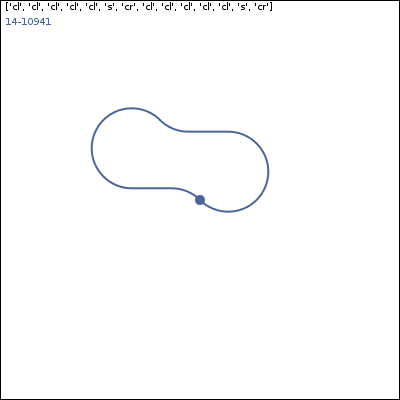

# Permutations of a childrens traiset
The purpose of this post is to explore and discover the number of permutations of a childrens 16 piece train track set.
The trainset of interest is the following:


This particular trainset has a total of 16 track piecies, 12 curved and 4 straight. The curved pieces are reversible (the straight ones are not) and 2 of the 4 straight pieces form a bridge as in the picture. I am interested in all solutions, for example those that use 10 or 12 pieces, not just all 16. Additionally, I want to solve this programatically and to create a visual representation of the solutions. A solution will be presented that uses Python to solve it programatically, along with a 2d graphics program called Cairo.

First, we need to determine if we are talking about permutations or combinantions? In the case of building a solution for a trainset, in which the order of the tracks does matter, we are talking about permutations without repetitions. In that case, the general formula for the number of permutations is the following:


**The Cauchy-Schwarz Inequality**

$$\left( \sum_{k=1}^n a_k b_k \right)^2 \leq \left( \sum_{k=1}^n a_k^2 \right) \left( \sum_{k=1}^n b_k^2 \right)$$

<p>$$n!/(n-r)!$$</p>

<p>Where n is the number of choices, in our case 16 for number of tracks, and r is how many are chosen from the set.  For example, the minimilist solution would be a circle, in which 8 pieces are used.  So, in order to find the one and only solution of 8 pieces, we would need to check the following number of permutations:</p>

<p>$$16!/(8)! = 518,918,400$$</p>

<p>That is a non-trivial number of permutations to verify that a solution is formed.  We would also need to check for solutions that have 9 pieces, 10 pieces, upto 16.  So the total number of potential solutions looks like:</p>

<p>$$16!/8! + 16!/7! + 16!/6! + 16!/5! + 16!/4! + 16!/3! + 16!/2! + 16!/1! + 16!/0!$$</p>

<p>It equates to:</p>

<p>$$5.687397556×10^{13}$$</p>

<p>For a more detailed analysis of the problem, see this question on <a href="http://cs.stackexchange.com/questions/40296/how-many-permutations-in-a-trainset">stackexchange</a>.</p>

```

def add_children(path, depth):
  if (depth == 1):
    yield path + ['cl']
    yield path + ['s']
    yield path + ['cr']
  else:
    for p in add_children(path + ['cl'], depth - 1): yield p
    for p in add_children(path + ['s'], depth - 1): yield p
    for p in add_children(path + ['cr'], depth - 1): yield p
```


14: 

# Permutations of a childrens traiset
http://mcconnma.github.io/posts/trainset-p1/
